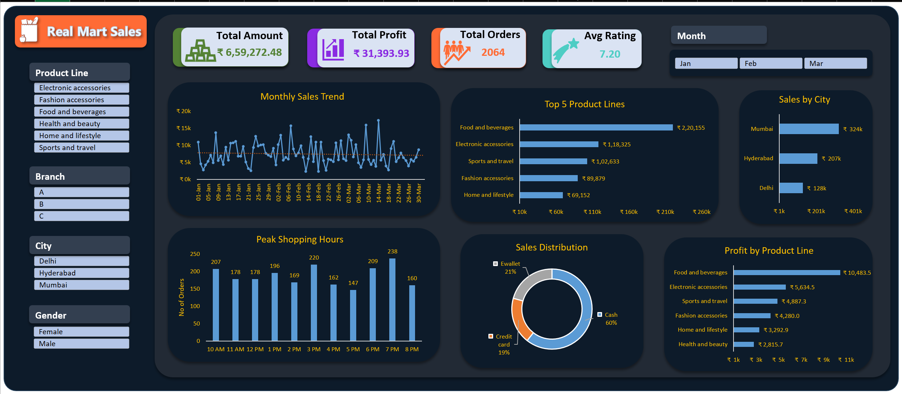

# Retail Sales Dashboard (Excel Project)

## Project Overview
This project presents an interactive Retail Sales Dashboard created using Microsoft Excel.  
The goal of this project is to analyze retail sales data and convert raw data into meaningful business insights through data visualization.

The dashboard provides an overview of sales performance, product trends, customer behavior, and profit distribution.

---

## Dashboard Preview

---

## Key Metrics
The dashboard tracks the following key metrics:

- Total Sales Amount
- Total Profit
- Total Orders
- Average Customer Rating

---

## Dashboard Features

### Monthly Sales Trend
Displays sales performance over time to identify patterns and fluctuations.

### Top Product Lines
Shows the highest performing product categories based on total sales.

### Sales by City
Compares sales performance across different cities.

### Peak Shopping Hours
Identifies the hours with the highest number of orders.

### Payment Method Distribution
Shows how customers prefer to pay (Cash, Credit Card, E-Wallet).

### Profit by Product Line
Highlights which product categories generate the most profit.

---

## Key Business Insights

- **Food and Beverages** is the highest revenue-generating product category.
- **Mumbai** generates the highest sales among all cities analyzed.
- The **peak shopping time occurs around 7 PM**, indicating strong evening customer activity.
- **Cash payments dominate transactions**, suggesting customers still prefer cash over digital payments.
- Some product categories generate significantly higher profits, indicating opportunities for targeted promotions.

---

## Tools Used

- Microsoft Excel
- Pivot Tables
- Data Cleaning
- Data Visualization
- Dashboard Design

---

## Dataset

The analysis uses a retail sales dataset containing information about:

- Product line
- Sales amount
- Profit
- City
- Payment method
- Order time
- Customer rating

---

## Author

Anik Singha  
Data Analytics / Data Science Learner